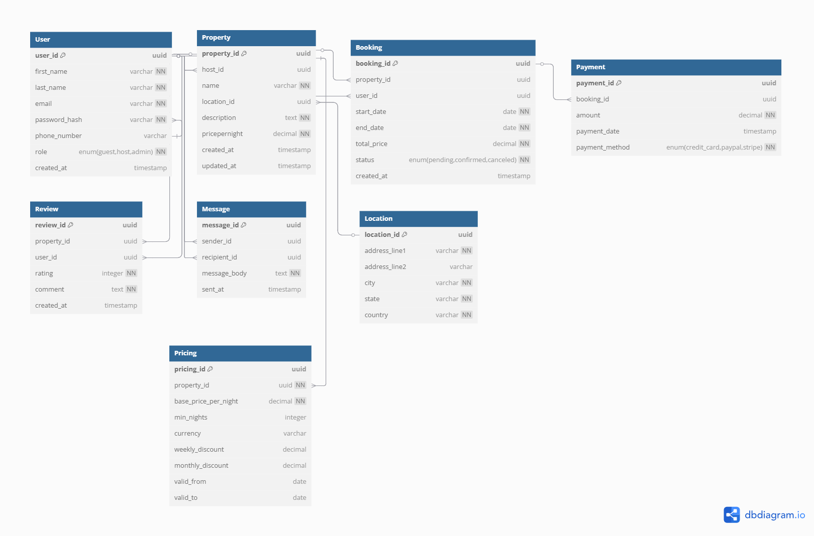

# Normalization Design and Diagram

# Database Normalization to 3NF: Schema Improvements

To conform the database to the 3rd Normal Form (3NF), the ERD was designed with the following changes:

## Location
- `Location table` was added to avoid transitive dependency with address data that depends on location rather than the property itself
- Added a `location_id` as a foreign key to Property table for a many-to-one relationship (multiple properties can share the same location)
- Contains atomic address components:
  - `address_line1`, `address_line2` (street-level details)
  - `city`, `state`, `country`

**Normalization Benefit:**
Eliminates duplicate address data across properties in the same location.

## Pricing
- `Pricing table` was added to separate dynamic pricing rules from static property details
- Includes:
  - `base_price_per_night` (required)
  - `weekly_discount` and `monthly_discount` (for long-term stays)
  - `valid_from`/`valid_to` dates (for seasonal pricing)
- Linked to Property via `property_id` foreign key (one-to-many relationship)

**Normalization Benefit:**
Allows historical price tracking and prevents update anomalies when rates change.

